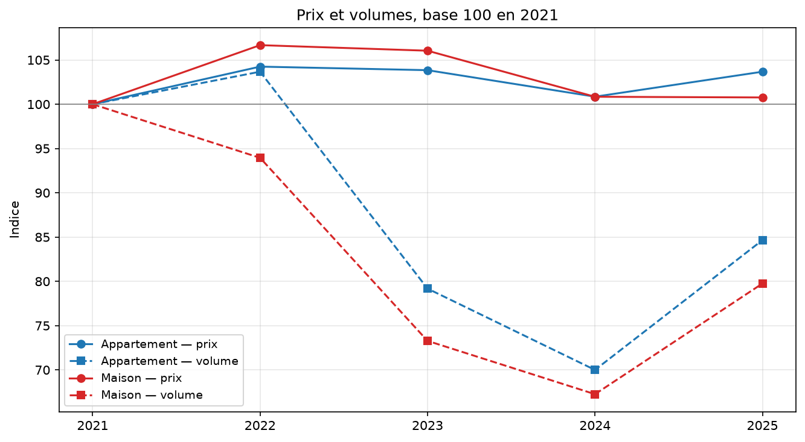
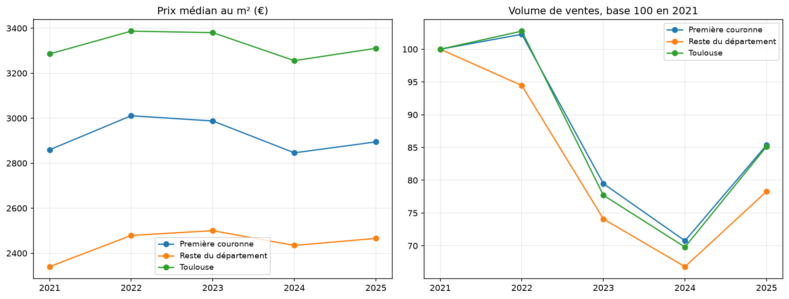

# Marché immobilier résidentiel en Haute-Garonne (2021–2025)

Analyse des transactions immobilières du département 31 à partir des données ouvertes des Demandes de Valeurs Foncières (DVF), avec un focus sur l'évolution des prix au m² par commune.

**Résultat principal :** entre 2021 et 2025, le marché a corrigé par les volumes et non par les prix. Les transactions ont chuté d'un tiers, tandis que le prix médian au m² est resté quasi stable.



---

## Contexte et objectifs

La Haute-Garonne, portée par l'aire urbaine toulousaine, figure parmi les départements français les plus dynamiques sur le plan démographique. Ce projet mesure, à partir de données publiques, l'évolution réelle des prix de l'immobilier résidentiel sur cinq années marquées par la remontée des taux d'intérêt.

Questions traitées :

- Comment le prix médian au m² a-t-il évolué entre 2021 et 2025 ?
- Quelles disparités observe-t-on entre Toulouse, sa première couronne et les communes rurales ?
- Le volume de transactions suit-il la même trajectoire que les prix ?
- Maisons et appartements connaissent-ils des dynamiques distinctes ?

---

## Résultats

### 1. Le marché a corrigé par les volumes, pas par les prix

Entre 2022 et 2024, les ventes d'appartements reculent de 32,5 % (12 478 → 8 425) et celles de maisons de 32,7 % (9 202 → 6 189). Sur la même période, le prix médian au m² ne baisse que de 3,3 % pour les appartements (2 969 → 2 872 €) et de 5,5 % pour les maisons (2 906 → 2 747 €).

L'écart est net : face au choc de crédit, les vendeurs ont préféré retirer leur bien plutôt que baisser leur prix. Le marché s'est figé avant de se déprécier. En 2025, les volumes repartent (+21 % pour les appartements) sans que les prix aient réellement corrigé.

### 2. La périphérie a décroché plus tôt et s'est moins bien redressée



Dès 2022, le reste du département tombe à 94 (base 100 en 2021) alors que Toulouse et la première couronne sont encore à 101–102. Le repli s'amorce donc un an plus tôt hors agglomération, là où la part d'acheteurs dépendants du crédit est la plus forte.

En 2025, la reprise est inégale : Toulouse et sa couronne remontent à 85, le reste du département seulement à 78. L'écart ouvert en 2022 ne s'est pas refermé.

### 3. La hiérarchie géographique est restée intacte

Toulouse (~3 300 €/m²), première couronne (~2 900 €/m²) et reste du département (~2 450 €/m²) évoluent en parallèle sur toute la période. La crise n'a pas rapproché les territoires.

### 4. Les prix au m² les plus élevés ne sont pas à Toulouse

Le classement des communes est dominé par le secteur sud-est de l'agglomération — Pin-Balma, Pechbusque, Balma, Mons, Lauzerville, Le Castéra, Préserville — sur les coteaux du Lauragais. Toulouse n'arrive qu'en neuvième position. La ville-centre concentre les volumes, pas les prix records.

---

## Validation

Les résultats ont été confrontés aux publications de la Chambre des notaires de la Cour d'appel de Toulouse.

| Indicateur (Toulouse, 2024) | Ce projet | Notaires 31 | Écart |
|---|---|---|---|
| Prix médian appartements | 3 182 €/m² | 3 170 €/m² | 0,4 % |
| Nombre de ventes | 5 469 | 5 459 | 0,2 % |

La convergence confirme la validité du périmètre retenu, et notamment l'exclusion des VEFA : les notaires raisonnent sur l'ancien, tandis que le neuf s'échangeait en 2024 autour de 4 620 €/m². Conserver les ventes sur plan aurait mécaniquement décalé la médiane vers le haut.

Les comparateurs en ligne affichent des valeurs sensiblement supérieures. Ils publient des moyennes calculées sur des biens proposés à la vente, non des médianes de transactions signées : les deux chiffres ne sont pas comparables.

---

## Source des données

Les données proviennent du jeu **Demandes de valeurs foncières géolocalisées**, publié par Etalab et dérivé de la base de la Direction générale des finances publiques (DGFiP). Cette version normalisée est privilégiée à la base brute : les identifiants de mutation y sont reconstitués et les parcelles géocodées.

| | |
|---|---|
| Producteur | DGFiP / Etalab |
| Périmètre | Département 31 (Haute-Garonne) |
| Période | 2021 – 2025 |
| Volume brut | 409 358 lignes |
| Licence | Licence Ouverte / Open Licence 2.0 |
| URL | https://files.data.gouv.fr/geo-dvf/latest/csv/ |

---

## Stack technique

| Outil | Usage |
|---|---|
| DuckDB | Moteur analytique, lecture directe des CSV compressés, requêtes SQL |
| Python / Jupyter | Orchestration, exploration |
| Matplotlib | Visualisation exploratoire |
| Parquet | Format des tables intermédiaires |
| Power BI | Restitution visuelle, modélisation en étoile |
| Git | Versionnement |

La transformation est intégralement écrite en SQL. DuckDB interroge les fichiers `.csv.gz` sans étape de chargement préalable, ce qui évite le recours à un serveur de base de données pour un volume de cet ordre. Python n'intervient qu'en orchestration et en visualisation.

---

## Structure des données brutes

Deux caractéristiques déterminent l'ensemble du traitement.

### Une mutation ≠ une ligne

Le jeu compte **409 358 lignes pour 158 391 mutations**, soit **2,58 lignes par transaction**.

Une mutation correspond à une vente. Elle peut porter sur plusieurs lots — appartements, maisons, dépendances, parcelles — chacun occupant une ligne distincte sous un même `id_mutation`. La distribution est fortement asymétrique : 49 395 mutations tiennent sur une seule ligne, 58 099 sur deux, mais la queue atteint plusieurs centaines de lots. La transaction la plus volumineuse compte 1 202 lignes et correspond à la cession d'un ensemble immobilier entier.

### Un prix dénormalisé

La colonne `valeur_fonciere` porte le prix **total de la mutation**, répété à l'identique sur chacune de ses lignes.

Deux conséquences directes :

- toute agrégation par `SUM(valeur_fonciere)` multiplie mécaniquement les montants ; la transaction citée plus haut produirait à elle seule plus de 32 milliards d'euros ;
- le prix au m² se calcule au niveau de la mutation, en rapportant la valeur foncière à la **somme** des surfaces bâties des lots concernés.

### Nature des mutations

| Nature | Lignes |
|---|---|
| Vente | 357 964 |
| Vente en l'état futur d'achèvement | 46 327 |
| Échange | 2 821 |
| Vente de terrain à bâtir | 1 102 |
| Adjudication | 1 003 |
| Expropriation | 141 |

---

## Méthodologie de filtrage

**1. Ventes classiques uniquement.** Les VEFA sont exclues (46 327 lignes, 11,3 %) : la vente sur plan relève d'une logique de prix propre — TVA, frais réduits, calendrier de livraison — non comparable au marché de la revente. Les échanges, adjudications et expropriations sont également écartés, ces transferts ne résultant pas d'une négociation de marché.

**2. Valeur foncière renseignée.** 1 473 lignes (0,36 %) supprimées. Aucune imputation n'est pratiquée : substituer une valeur médiane à un prix manquant reviendrait à inventer une transaction.

**3. Un seul logement par mutation.** Sont retenues les mutations comportant exactement un bien de type `Maison` ou `Appartement`. Les dépendances associées sont conservées : elles font partie du prix.

Après application des critères 1 à 3 : **93 493 mutations**.

Les mutations écartées se répartissent ainsi : 50 976 sans aucun logement (terrains, garages isolés, locaux commerciaux), et 11 647 ventes groupées (7,4 %) comportant deux logements ou plus, dont le prix global ne peut être réparti sans hypothèse arbitraire.

**4. Surface bâtie exploitable.** Bornes retenues : **9 à 400 m²**. Le plancher correspond à la surface minimale légale d'un logement décent ; en deçà, le bien n'est juridiquement pas un logement (9 mutations concernées). Le plafond écarte 29 biens atypiques dont la présence déforme les médianes communales. Une seule mutation présentait une surface manquante.

Les dépendances sont exclues du dénominateur — leur surface n'est pas renseignée — mais leur valeur reste incluse au numérateur : biais assumé, à la hausse, sur les biens en comportant.

**5. Valeurs extrêmes de prix au m².** Deux filtres successifs.

*Seuils relatifs.* Les percentiles 1 et 99 sont calculés par commune et type de bien lorsque le groupe compte au moins 30 transactions, et à l'échelle départementale sinon. Ce seuil est nécessaire : 495 des 776 groupes comptent moins de 30 ventes, un percentile y serait dénué de sens. L'approche par écart interquartile a été écartée après test — sur une distribution aussi asymétrique, la borne haute tombait à 5 547 €/m², ce qui aurait supprimé l'ensemble du centre de Toulouse. 2 276 mutations exclues (2,44 %).

*Plancher absolu à 500 €/m².* Le filtre relatif laissait subsister des maisons à 10–100 €/m², concentrées dans les communes rurales du Comminges et du sud-ouest du département. Vérification faite, il ne s'agit pas d'erreurs de saisie mais de ventes réelles de bâtis en ruine ou à démolir : la transaction porte alors sur un terrain assorti d'une charge de démolition, et non sur un logement. Le seuil de 500 €/m² correspond à l'ordre de grandeur en deçà duquel le prix ne couvre pas le coût des matériaux. Un seuil à 800 €/m² aurait écarté 1 331 ventes, dont des logements habitables dans des communes en déprise démographique.

**Échantillon final : 90 776 mutations**, soit 57 % du jeu initial.

**6. Agrégation.** Les tables de restitution retiennent les groupes d'au moins 5 transactions, afin qu'aucune médiane communale ne repose sur un effectif non significatif. Couverture : 87 757 ventes, soit 96,7 % de l'échantillon final.

---

## Protection des données personnelles

Le jeu DVF ne contient ni nom, ni prénom des parties. Il comporte en revanche l'adresse et la référence cadastrale des biens, données permettant une identification indirecte des propriétaires. Le RGPD s'applique donc à ce traitement.

Conformément au cadre applicable aux données publiées en open data en application du CRPA, le consentement des personnes concernées n'est pas requis. La republication constitue néanmoins un traitement au sens du RGPD, dont l'auteur du présent dépôt est responsable.

Mesures appliquées :

- **Aucune donnée de transaction individuelle n'est publiée.** Les fichiers sources ne sont pas versionnés et les tables diffusées sont agrégées à la maille commune × année × type de bien, avec un effectif minimal de 5 transactions par groupe.
- **Les sorties de notebook contenant des lignes individuelles ont été supprimées** — adresses, références de parcelle, transactions isolées en petites communes. Le code reste intégralement reproductible.
- **Minimisation** : sur les quarante colonnes du jeu source, huit sont exploitées. Les colonnes d'adresse et de géolocalisation ne sont chargées à aucun moment du traitement.
- **Finalité** : analyse statistique du marché immobilier, à des fins non commerciales et démonstratives. Toute tentative de réidentification d'une partie à une transaction est exclue du périmètre de ce projet.

Contact : voir le profil GitHub associé à ce dépôt.

---

## Structure du dépôt

```
dvf-toulouse/
├── data/
│   ├── raw/              # CSV sources (non versionnés)
│   └── processed/        # Tables agrégées au format Parquet
├── figures/              # Graphiques exportés
├── notebooks/
│   └── 01_exploration.ipynb
├── power_bi/             # Captures du rapport
├── README.md
└── pyproject.toml
```

Le fichier `.pbix` n'est pas versionné : format binaire, illisible en diff. Seules les captures du rapport figurent dans le dépôt.

---

## Reproduction

```bash
git clone <url-du-depot>
cd dvf-toulouse
uv sync

mkdir -p data/raw
for y in 2021 2022 2023 2024 2025; do
  curl -fL -o data/raw/$y.csv.gz \
  "https://files.data.gouv.fr/geo-dvf/latest/csv/$y/departements/31.csv.gz"
done
```

Le notebook s'exécute ensuite de haut en bas.

---

## Limites de l'analyse

- Le millésime `latest` de geo-dvf ne conserve que les cinq dernières années. Une reproduction ultérieure portera sur une fenêtre décalée.
- Les cessions de parts de sociétés civiles immobilières n'apparaissent pas dans DVF, ce qui minore la représentation des transactions patrimoniales.
- Le jeu ne renseigne ni l'état du bien, ni sa performance énergétique, ni sa situation locative. Une part de la variance des prix reste donc inexpliquée.
- L'année la plus récente peut être incomplète, la publication intervenant avec un décalage lié à l'enregistrement des actes.
- L'analyse est descriptive : aucune modélisation explicative ou prédictive n'est proposée à ce stade.
- Le jeu DVF ne couvre ni l'Alsace-Moselle ni Mayotte, qui relèvent d'un régime cadastral distinct — sans effet sur le présent périmètre.

---

## Licence

Données sous Licence Ouverte 2.0 (Etalab). Code sous licence MIT.
